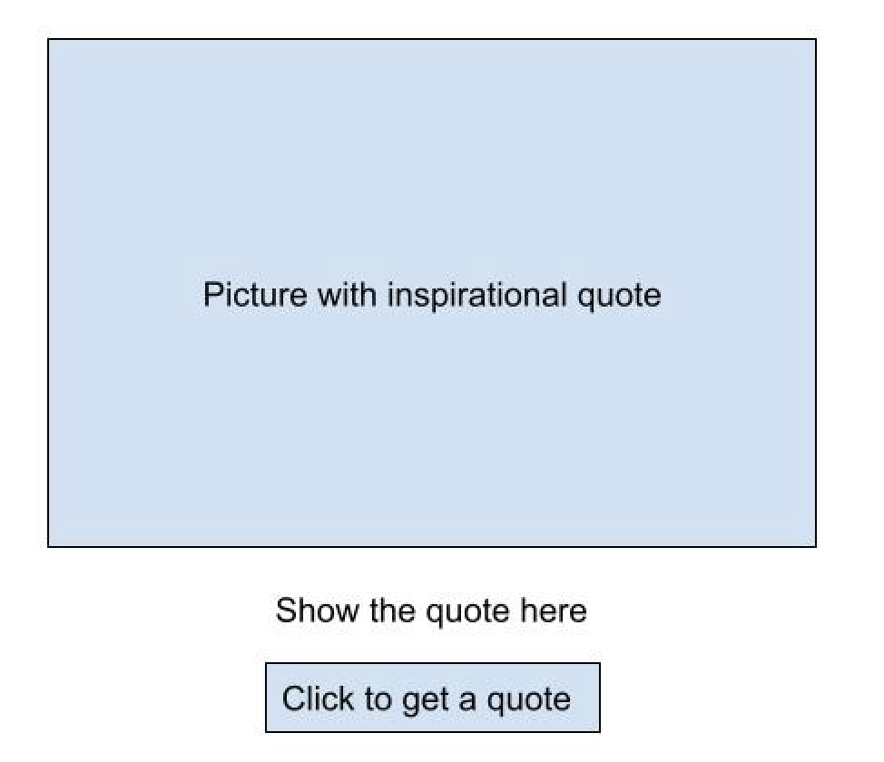

## Project: Mixed Message
-------------------------

### Table of contents
  - [General Info](#general-info)
  - [Techonologies Used](#techonologies-used)
  - [Features](#features)
  - [Contact](#contact)

### General Info
1. creating a message generator program. Every time a user runs a program, they should get a new, randomized output. 
2. using Git locally on  personal computer and using GitHub to back it up

### Techonologies Used
1. HTML
2. Javascript

### Features

### Contact
zhihualiu6118@gmail.com

